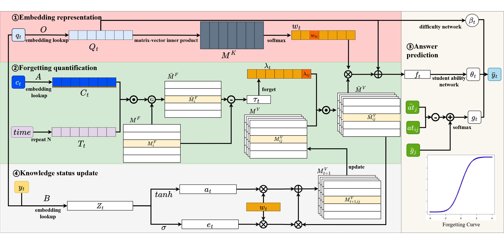

# KVFKT: A New Horizon in Knowledge Tracing with Attention-Based Embedding and Forgetting Curve Integration

 

This is the official implementation for our paper **KVFKT: A New Horizon in Knowledge Tracing with Attention-Based Embedding and Forgetting Curve Integration**, accepted by **COLING'25**.

## Requirements
The code is built on Pytorch and the [pyKT](https://github.com/pykt-team/pykt-toolkit/tree/main) benchmark library. Run the following code to satisfy the requeiremnts by pip: `pip install -r requirements.txt`

## Datasets
- Download the three public datasets we use in the paper at:

  [ASSISTments 2012](https://sites.google.com/site/assistmentsdata/datasets/2012-13-school-data-with-affect)

  [EdNet](https://github.com/riiid/ednet)

  [NeurIPS](https://eedi.com/projects/neurips-education-challenge)
  
  [FSAI-F1toF3](https://www.4littletrees.com/)

- Preprocess the dataset using [pyKT](https://github.com/pykt-team/pykt-toolkit/tree/main) to obtain the student's mastery level of knowledge concepts **(MLKC)**, the probability of knowledge concepts appearing in the next exercise **(PKC)**, and the forgetting rate of knowledge concepts **(FRKC)**.

## Run KVFKT

`python run.py --do_train --cuda --data_path ../data/algebra2005 --model TransE -b 1024 -d 1000 -g 12.0 -a 1.0 -lr 0.001 -adv -save models/algebra2005/TransE_adv`.

## The interpretability of KVFKT

 
